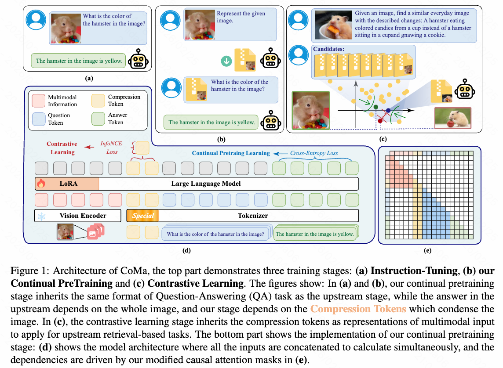
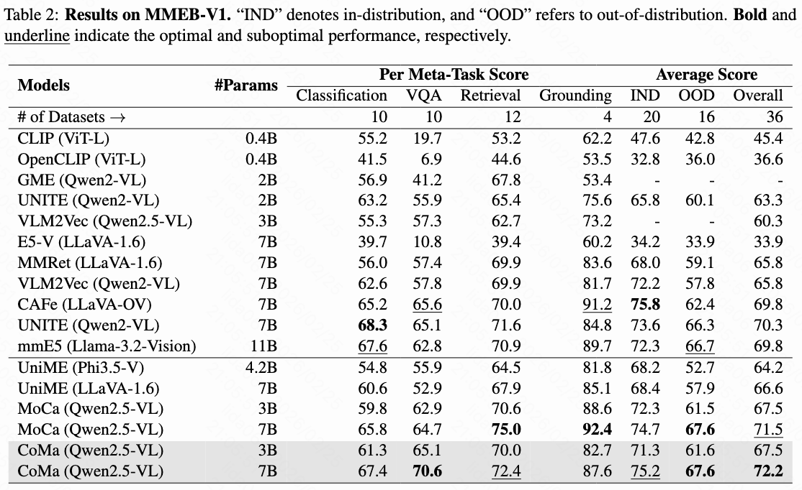

# CoMa: Compression then Matching: An Efficient Pre-training Paradigm for Multimodal Embedding

<p align="center">
        &nbsp&nbsp 📙 <a href="https://arxiv.org/pdf/2511.08480">Our Paper</a>&nbsp&nbsp |
        &nbsp&nbsp 🤗 <a href="https://huggingface.co/datasets/404-not-founds/CoMa_3B_SFT">CoMa-3B-SFT Data</a>&nbsp&nbsp |
        &nbsp&nbsp 🤗 <a href="https://huggingface.co/datasets/404-not-founds/CoMa_7B_SFT">CoMa-7B-SFT Data</a>&nbsp&nbsp |
        &nbsp&nbsp 🤗 <a href="https://huggingface.co/404-not-founds/CoMa-3B">CoMa-3B</a>&nbsp&nbsp |
        &nbsp&nbsp 🤗 <a href="https://huggingface.co/404-not-founds/CoMa-7B">CoMa-7B</a>&nbsp&nbsp 
</p>

## Introduction
An effective embedding is expected to comprehensively preserve the semantic content of the input while simultaneously emphasizing features that are discriminative for downstream tasks. Recent approaches demonstrate that MLLMs can be adapted into competitive embedding models via large-scale contrastive learning, enabling the simultaneous optimization of two complementary objectives. We argue that the two aforementioned objectives can be decoupled: a comprehensive understanding of the input facilitates the embedding model in achieving superior performance in downstream tasks via contrastive learning. we propose CoMa, a compressed pre-training phase, which serves as a warm-up stage for contrastive learning. Experiments demonstrate that with only a small amount of pre-training data, we can transform an MLLM into a competitive embedding model. CoMa achieves new state-of-the-art results among MLLMs of comparable size on the MMEB, realizing optimization in both efficiency and effectiveness.

## Architecture
The overall architecture is shown as follows:
<div style="display: flex;">
  
</div>

## Performance
<p align="center" style="display:flex;">
    
<p>

## Data Preparation
Our pre-training data construction files are located in the data_prepare folder. To obtain the final pre-trained data, you must sequentially execute sample.py, auto_q.py, and auto_a.py. Please note that you must replace the file paths and model names within each script. We use [vllm](https://github.com/vllm-project/vllm) to deploy and invoke MLLMs.

## Environmental Requirements
The packages we use during training and inference can be found in requirements.txt
``` bash
pip install -r requirements.txt
```

## Training 
``` bash
./scripts/train-qwen2_5vl-3B_qa.sh
```
## Inference 
``` bash
./scripts/eval.sh
```

## Acknowledgements
This project is based on the work of [VLM2Vec](https://github.com/TIGER-AI-Lab/VLM2Vec).  


## License Agreement
All of our open-source models are licensed under the [Apache-2.0](./LICENSE) license.

